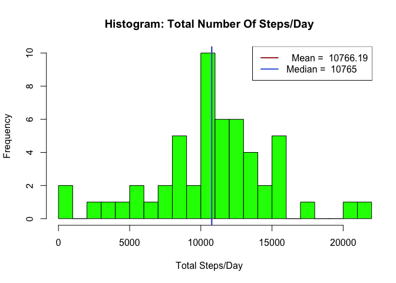
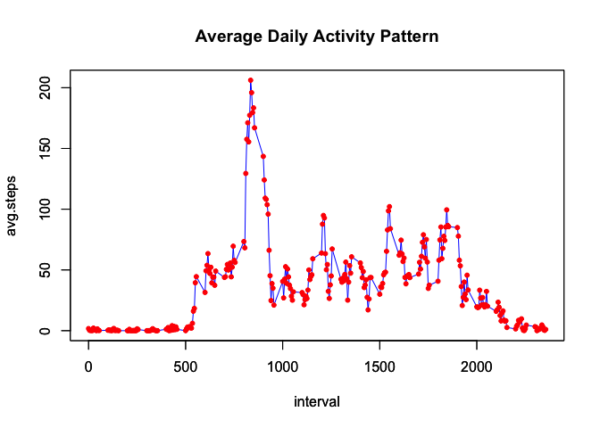
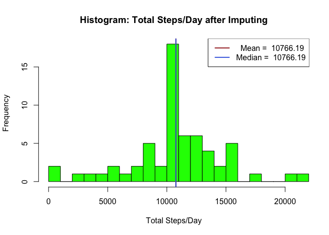
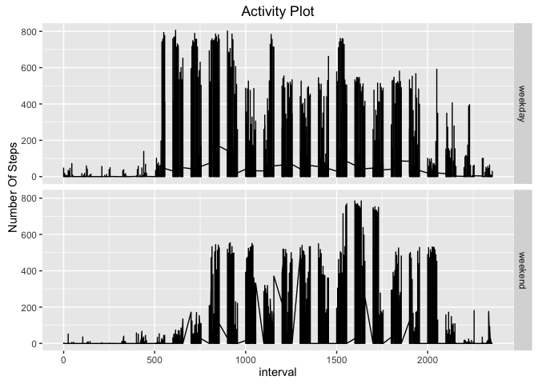

# Reproducible Research: Peer Assessment 1


#
#
This project is part of Coursera's Reproducible Research course assignment for
week 2. This exercise demonstrates knowledge of using R markdown for the purpose
of intertwining R code, documentation and code output in one document.

There are several parts to this assignment as described below.

***
#
#
# Part 1: Loading and preprocessing data
#

Activity data from a personal activity monitoring device (activity.csv) is
assumed to be downloaded and available in the current working directory. A
basic read.csv command loads the data.

The data is processed using several functions available in the *dplyr* package
and plotted using basic and *ggplot2* graphing systems. These libraries are
loaded accordingly.


```r
## Loading and preprocessing the data

library(dplyr)
library(ggplot2)

df <- read.csv("activity.csv", stringsAsFactors = TRUE)
```
***
#
#
# Part 2: Calculating and Plotting the mean total number of steps per day
#

We have been asked to ignore NAs during this part of the exercise.
The input table has 3 columns: number of steps, date and interval labels. The code groups data by date and summarizes the average total steps per day.


```r
sum_by_date <- summarise(group_by(df[complete.cases(df),],date), Total.Steps = sum(steps))
sum_by_date <- mutate(sum_by_date, Date_type = as.Date(date, "%Y-%m-%d"))
```

A histogram of the total number of steps is created using the basic graphics
plotting system. Calculating mean and median of the total steps by day is simple
using the available data. On the plot, the mean and median are shown with 2 
vertical lines.


```r
## Histogram of the total number of steps taken each day
xlimit=max(sum_by_date$Total.Steps)
hist(sum_by_date$Total.Steps,breaks = 20, col="green", xlab = "Total Steps/Day",
     xlim=c(0,xlimit), main = "Histogram: Total Number Of Steps/Day")

## Show mean/median on the plot
steps_mean <- mean(sum_by_date$Total.Steps)
steps_median <- median(sum_by_date$Total.Steps)
abline(v = steps_mean, col = "brown", lwd=2)
abline(v = steps_median, col = "royalblue", lwd=2)

leg_mean =   paste("  Mean = ", round(steps_mean,digits=2))
leg_median = paste("Median = ", round(steps_median,digits=2))

legend(x = "topright", c(leg_mean,leg_median), col=c("brown","royalblue"), lwd=c(2,2))
```

<!-- -->

Since the mean and median are close to each other, separation between the two
lines is not clearly visible.


```r
## Print mean/median on the console
cat("Mean of the total number of steps/day: ", steps_mean, "\n")
```

```
## Mean of the total number of steps/day:  10766.19
```

```r
cat("Median of the total number of steps/day: ", steps_median, "\n")
```

```
## Median of the total number of steps/day:  10765
```
***
#
#
# Part 3: Showing the average daily activity pattern by interval
#

The original data is now grouped by interval (instead of date), so that the 
average number of steps/interval can be summarised for all the dates.


```r
## What is the average daily activity pattern?

sum_by_interval <- group_by(df[complete.cases(df),], interval) %>% 
                    summarise(avg.steps=mean(steps)) 
```

A time-series plot is created using the basic graphics system.


```r
plot.new()
with(sum_by_interval,
     plot(x=interval,y=avg.steps,col="blue",type="l", 
          main="Average Daily Activity Pattern")
     )
par(new = TRUE)
with(sum_by_interval,
     plot(x=interval,y=avg.steps,pch=20,col="red")
     )
```

<!-- -->

Finding the interval with the maximum number of steps is a simple task since the
data is organized as a <interval,avg.steps> table.


```
## Here is the 5-minute interval with the maximum number of steps:
```

```
## # A tibble: 1 × 2
##   interval avg.steps
##      <int>     <dbl>
## 1      835  206.1698
```

***
#
#
# Part 4: Imputing missing values
#

The original data came with several NAs in the steps column. Here we try to 
populate the NAs with actual averages calculated from the remaining part of 
the data.


```r
## Imputing missing values

## Calculate and report the total number of mission values (NAs) in the dataset
cat("The number of missing values in the dataset: ", sum(!complete.cases(df)),"\n")
```

```
## The number of missing values in the dataset:  2304
```

We have already computed a table of (interval,avg.steps) values which we can use
to find avg.steps whenever we find an NA in the original data set. The following
code does the appropriate find and replace. A similar histogram as in Part 2 is now created using this newly created data set.


```r
## Calculate average number of steps per interval over all days. Use that to populate intervals that are NA
## Create a new dataset df2
df2 <- mutate(df, steps = ifelse(is.na(steps), 
                                 sum_by_interval[match(interval,sum_by_interval$interval),2]$avg.steps,
                                 steps
                                )
              )

## Apply the same procedure as before to generate histogram
sum_by_date <- summarise(group_by(df2,date), Total.Steps = sum(steps))
sum_by_date <- mutate(sum_by_date, Date_type = as.Date(date, "%Y-%m-%d"))

sum_by_date <- df2 %>% group_by(date) %>% 
                       summarise(Total.Steps = sum(steps)) %>%
                       mutate(Date_type = as.Date(date, "%Y-%m-%d")) 


## Histogram of the total number of steps taken each day
hist(sum_by_date$Total.Steps,breaks = 20, col="green", xlab = "Total Steps/Day",
     xlim=c(0,xlimit), main = "Histogram: Total Steps/Day after Imputing")

steps_mean <- mean(sum_by_date$Total.Steps)
steps_median <- median(sum_by_date$Total.Steps)
abline(v = steps_mean, col = "brown", lwd=2)
abline(v = steps_median, col = "royalblue", lwd=2)

leg_mean =   paste("  Mean = ", round(steps_mean, digits=2))
leg_median = paste("Median = ", round(steps_median,digits = 2))

legend(x = "topright", c(leg_mean,leg_median), col=c("brown","royalblue"), lwd=c(2,2))
```

<!-- -->

```r
cat("Mean of the total number of steps/day AFTER Imputing: ", steps_mean, "\n")
```

```
## Mean of the total number of steps/day AFTER Imputing:  10766.19
```

```r
cat("Median of the total number of steps/day AFTER Imputing: ", steps_median, "\n")
```

```
## Median of the total number of steps/day AFTER Imputing:  10766.19
```

We can compare the mean/median above with the mean/median in Part 2. Imputing
the data has not changed the mean but the median has moved towards the mean.
This is to be expected since we have used the mean (avg.steps) to populate
NAs, so the mean should not be changing.
#***
#
#
# Part 5: Differences in Weekend/Weekday activity patterns
#

Here we add a column to the imputed data set with weekday/weekend information.
A time series plot is created with a panel each for weekday and weekend.


```r
## Are there differences in activity patterns between weekdays and weekends?
df2 <- mutate(df2, day = as.factor(ifelse(weekdays(as.Date(df2[,"date"])) %in% c("Saturday","Sunday"), 
                                        "weekend", 
                                        "weekday"
                                   )) 
               )
q = qplot(interval, steps, data=df2, facets = day~., geom="line",
          main="Activity Plot", ylab="Number Of Steps") 
q
```

<!-- -->

With the weekday and weekend data separated out, it is easy to see that subject
logged more activity during the weekdays on an average than on weekends. This
can be expected.

***
